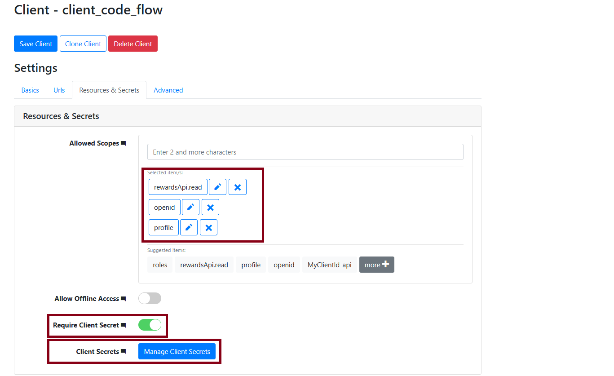

# OAuthArticle.Admin

**OAuthArticle.Admin** is an educational solution designed to explain and demonstrate the functionality of the **OAuth 2.0** protocol through a practical implementation. This project aims to help developers better understand and configure authentication and authorization flows.  

To emphasize the core principles of OAuth 2.0, I chose **Skoruba Duende IdentityServer** as the foundation, enabling a focused exploration of this protocol in a real-world context. If you prefer a solution without the admin project, you can simply create a new **Duende IdentityServer** solution without the administrative interface. You can find the documentation [here](https://docs.duendesoftware.com/identityserver/v7).

---

## 🛠️ Key Features

- Implementation of core **OAuth 2.0** concepts:
  - Authorization Code Flow.
  - Use of scopes and roles.
- Admin interface for managing clients, users, and authorizations.
- Example of integration with a secured API.
- Comprehensive documentation for easier learning.

---

## 📚 Objectives

This project aims to:

1. Illustrate the theoretical concepts of **OAuth 2.0**.
2. Provide a practical environment to experiment with authentication flows.
3. Simplify the configuration of clients, scopes, and tokens.
4. Offer a foundation for building real-world projects requiring secure authentication mechanisms.

---

## 🖥️ Setup and Installation

### Prerequisites

- [Visual Studio](https://visualstudio.microsoft.com/) (or any compatible .NET IDE).
- .NET SDK 8.0 or higher.
- A database (default: **SQL Server**).

### Installation Steps

1. Clone this repository:
   ```bash
   git clone https://github.com/ReneRugaba/OAuthArticle.Admin.git
   cd OAuthArticle.Admin
   ```

2. Configure the database connection in the `OAuthArticle.Admin/appsettings.json` and `OAuthArticle.STS.Identity/appsettings.json` files:
    ```json
    // Admin appsettings
    "ConnectionStrings": {
        "ConfigurationDbConnection": "",
        "PersistedGrantDbConnection": "",
        "IdentityDbConnection": "",
        "AdminLogDbConnection": "",
        "AdminAuditLogDbConnection": "",
        "DataProtectionDbConnection": ""
    }

    // Identity appsettings
    "ConnectionStrings": {
        "ConfigurationDbConnection": "",
        "PersistedGrantDbConnection": "",
        "IdentityDbConnection": "",
        "DataProtectionDbConnection": ""
    }
    ```

3. Initialize the database (two options):
    - **Option 1: Use a pre-seeded database**  
      Disable seeding in the `appsettings.json` file and restore the provided `.bacpac` file in the `db-file` folder:
      ```json
      "SeedConfiguration": {
          "ApplySeed": false
      }
      ```
    - **Option 2: Seed the database on first run** if you want to implement your own client flow configuration.  
      Edit the `appsettings.json` file as needed, then run the solution

---

## 📂 Project Structure

```plaintext
OAuthArticle.Admin
│
├── api
│   ├── OAuthArticle.ApiRewards             // A secured API to retrieve data after authorization and authentication steps
│
├── client
│   ├── ClientCodeApp.example               // Example code for server client app to test code flow
│   ├── DemoApp.example                     // Demo application 
│   ├── implicite-app (hide)               // React app to test implicit flow
│
├── src
│   ├── OAuthArticle.Admin                  // Core admin interface project
│   ├── OAuthArticle.Admin.Api              // Admin APIs
│   ├── OAuthArticle.Admin.EntityFramework.MySql
│   ├── OAuthArticle.Admin.EntityFramework.PostgreSQL
│   ├── OAuthArticle.Admin.EntityFramework.SqlServer
│   ├── OAuthArticle.Shared                 // Shared libraries and utilities
│   ├── OAuthArticle.STS.Identity           // Identity Server (STS) implementation
```

---

## 🧪 Testing OAuth 2.0 Flows

### Authorization Code Flow

#### Using Admin UI:
1. **Create a client application**:
   - Navigate to the **Admin UI** and create a new client.
   - Assign a unique **Client ID** (e.g., `client_code_flow`) to your client application.
   
2. **Configure Grant Types**:
   - In the **Grant Types** tab, select `authorization_code` as the allowed grant type. This ensures that the client application can use the Authorization Code Flow.

   Example Screenshot:

   

3. **Set Allowed Scopes**:
   - In the **Resources & Secrets** tab, specify the **Allowed Scopes** that the client can request. This ensures the application has access only to the APIs and user data it needs.
   - Example of allowed scopes:
     - `rewardsApi.read`: For reading data from a specific API.
     - `openid`: For OpenID Connect authentication.
     - `profile`: To include user profile information.

   Example Screenshot:

   

4. **Configure Client Secrets**:
   - Enable the **Require Client Secret** option to ensure the client authenticates itself when exchanging the authorization code for an access token.
   - Manage and store the client secrets securely by clicking on **Manage Client Secrets**.

---

#### Configuring the Client in ASP.NET Core:

The following code configures the client application in ASP.NET Core to use the **Authorization Code Flow**:

```csharp
var builder = WebApplication.CreateBuilder(args);

// Add services to the container.
builder.Services.AddRazorPages();
builder.Services.AddServerSideBlazor();

builder.Services.AddHttpContextAccessor();

// Configure HTTP client for API requests
builder.Services.AddHttpClient("IDPClient", client =>
{
    client.BaseAddress = new Uri("https://localhost:44310/"); // IdentityServer URL
    client.DefaultRequestHeaders.Accept.Add(new MediaTypeWithQualityHeaderValue("application/json"));
});

// Configure authentication
builder.Services.AddAuthentication(opt =>
{
    opt.DefaultScheme = CookieAuthenticationDefaults.AuthenticationScheme; // Use cookies for authentication
    opt.DefaultChallengeScheme = "OAuth2"; // Default challenge redirects to OAuth2
})
.AddCookie(CookieAuthenticationDefaults.AuthenticationScheme)
.AddOAuth("OAuth2", opt =>
{
    opt.ClientId = "client_id_code_flow"; // Client ID registered in IdentityServer
    opt.ClientSecret = "client_secret_codeflow"; // Client Secret
    opt.CallbackPath = "/callback"; // Redirect URI for handling responses
    opt.AuthorizationEndpoint = "https://localhost:44310/connect/authorize"; // Authorization endpoint
    opt.TokenEndpoint = "https://localhost:44310/connect/token"; // Token endpoint
    opt.UserInformationEndpoint = "https://localhost:44310/connect/userinfo"; // User Info endpoint
    opt.Scope.Add("rewardsApi.read"); // Requested scope
    opt.Scope.Add("openid");
    opt.Scope.Add("profile");
    opt.SaveTokens = true; // Persist tokens in the authentication session
    opt.UsePkce = true; // Enforce PKCE for enhanced security
});

// Configure authorization policies
builder.Services.AddAuthorization(opt =>
{
    opt.FallbackPolicy = new AuthorizationPolicyBuilder()
        .RequireAuthenticatedUser() // Enforce authentication for all requests
        .Build();
});

var app = builder.Build();

if (!app.Environment.IsDevelopment())
{
    app.UseExceptionHandler("/Error");
    app.UseHsts();
}

app.UseHttpsRedirection();
app.UseStaticFiles();
app.UseRouting();
app.UseAuthentication();
app.UseAuthorization();
app.MapBlazorHub();
app.MapFallbackToPage("/_Host");

app.Run();
```

#### Key Points of the Configuration:
- `AuthorizationEndpoint` and `TokenEndpoint` are used to interact with IdentityServer.
- `Scope` defines the permissions the client requests.
- `UsePkce` enforces security by enabling Proof Key for Code Exchange.

---

### Implicit code flow


## 📖 Additional Resources

- [OAuth 2.0 Official Documentation](https://oauth.net/2/)
- [OIDC (OpenID Connect) Guide](https://openid.net/connect/)
- [Skoruba IdentityServer Examples](https://github.com/skoruba/Duende.IdentityServer.Admin)
